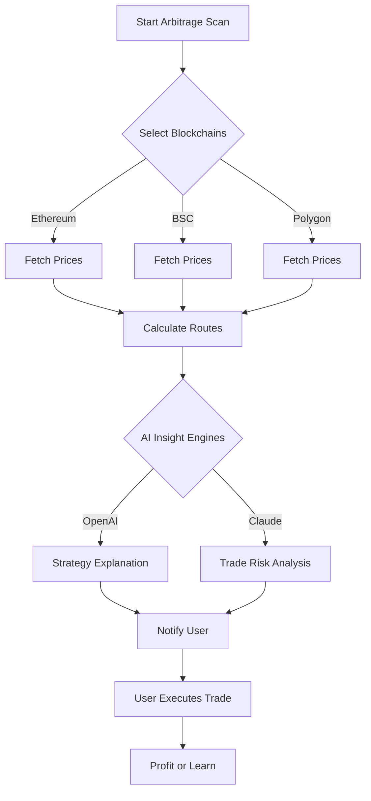

# 🌌 CrossChain Explorer

> Pioneering the next dimension of decentralized finance by uncovering and analyzing cross-chain arbitrage pathways.

---

## 🚀 Project Overview

**CrossChain Explorer** is an advanced analytics and automation tool for detecting and optimizing arbitrage opportunities **across Ethereum, Binance Smart Chain, Polygon, Optimism, and more**. Designed for both casual and professional DeFi enthusiasts, this platform leverages OpenAI and Claude AI integrations, providing not only algorithmic insights but also a responsive, multilingual UI with real-time support—even during cosmic surges in network activity.

Whether you are an architect of liquidity or an explorer in the galaxy of digital assets, CrossChain Explorer enables you to harness the hidden patterns of DeFi without the need for manual scouting. Get the edge with seamless arbitrage discovery, comprehensive data visualizations, and intelligence that adapts to you—like a cosmic compass guiding your trades.

---

## 🎯 Key Features

- ✨ **Automatic Cross-Chain Arbitrage Discovery:** Detects profit opportunities between any two or more supported blockchains with real-time exchange data.
- 🌐 **Responsive, Multilingual UI:** Interact in English, Spanish, Mandarin, French, and beyond.
- 🤖 **AI-Powered Insights:** Integrates both OpenAI and Claude APIs for context-aware recommendations and explainer summaries.
- 🕰 **24/7 Customer Support:** Chat system embedded within the web app, powered by hybrid human and AI agents.
- 📊 **Dynamic Visualizations:** Track arbitrage, profits, liquidity depths, and gas costs with interactive charts and topology diagrams.
- 🏦 **Portfolio Simulation:** Enter your own wallet addresses or simulate trades to preview net effects before making any transactions.
- 🔄 **Configurable Alerts:** Get notified via email, Discord, or Slack when fresh opportunities arise.
- 🔒 **Security-First:** Local secret management and encrypted network requests; no keys ever leave your machine.
- 💡 **Learning Hub:** Step through educational modules about arbitrage and DeFi strategy, with quizzes and instant feedback.
- 🛠 **API and CLI Accessibility:** Utilize CrossChain Explorer directly from your terminal, or build on top of its REST API for automation.

---

## 📈 SEO-Optimized Benefits

Imagine discovering the most lucrative routes in decentralized finance, optimized for security and speed. CrossChain Explorer is the premier tool for crypto arbitrage on Ethereum, BNB Chain, and Polygon, helping you boost profits, forecast risks, and stay ahead of the DeFi curve with AI-driven insights.

Keywords naturally covered: cross-chain arbitrage, DeFi analytics, Ethereum BNB Polygon arbitrage, AI crypto trading tools, DeFi data visualization, responsive web3 dashboard, multilingual blockchain tools.

---

## 🖥️ OS Compatibility Table

| OS         | Supported | Special Notes               | Icon                |
|------------|:---------:|----------------------------|---------------------|
| Windows 11 | ✔️        | Smoothest experience       | 🪟                  |
| macOS 13+  | ✔️        | Apple M-series optimized   | 🍏                  |
| Ubuntu 22+ | ✔️        | Native, snap supported     | 🐧                  |
| Fedora 39+ | ✔️        | Full support               | 🔵                  |
| iOS Safari | ✔️        | UI fully mobile responsive | 📱                  |
| Android    | ✔️        | All major browsers         | 🤖                  |

---

## 🌍 Example Profile Configuration

To begin your odyssey, create a `.xchainexplorer` configuration file in your home directory with keys and preferences:

    # ~/.xchainexplorer
    [profile]
    preferred_language = "es"
    theme = "dark"
    chains_enabled = ["ethereum", "bsc", "polygon"]
    notification_channels = ["email", "discord"]

    [api_keys]
    openai = "sk-your-openai-key"
    claude = "sk-your-claude-key"
    etherscan = "your-etherscan-key"
    bscscan = "your-bscscan-key"

    [security]
    encrypt_secrets = true

---

## 🕹️ Example Console Invocation

To scan for arbitrage opportunities with live AI summaries:

    $ xchainexplorer scan --chains ethereum,bsc,polygon --ai-insights

To simulate a portfolio trade:

    $ xchainexplorer simulate --wallet 0x123abc... --amount 6.5ETH --route polygon-bsc

---

## ⛓️ Mermaid Diagram: Cross-Chain Arbitrage Flow

---

## 🏆 Feature List

- Multi-chain arbitrage finder 🔍
- No-code onboarding wizard 🚦
- AI-explained trade recommendations 🤖
- Custom rule-based alerts 📲
- Historical opportunity backtesting 📉
- Full OpenAI & Claude chatbot support 💬
- Real-time P&L tracking 💰
- Advanced user privacy controls 🔐
- REST API and CLI interface 🖥️
- Accessibility optimized, WAI-ARIA compliant ♿
- Modular plugin architecture 🔌

---

## 🤝 Integrations

- **OpenAI API** - Generates strategy write-ups and user onboarding guidance based on detected opportunities.
- **Claude API** - Provides independent risk/benefit evaluation reports and conversational Q&A.
- **Discord/Slack bots** - Get alerts in your trading groups directly.
- **Block Explorer APIs** - Onchain data from all supported networks.

---

## 🧠 Example Use Case: The "Galaxy Arbitrage"

Picture discovering and being notified of a Polygon➡️Ethereum➡️BSC triangular arbitrage opportunity, all within 1.5 seconds of price change, with AI carefully breaking down the timing, slippage, and required capital. You simulate outcomes before risking any assets, and the built-in multilingual support ensures everyone on your team can collaborate—without language barriers.

---

## ⚠️ Disclaimer

CrossChain Explorer is an analytics and automation tool designed for research and educational purposes only. While every effort has been made to ensure data accuracy and transaction security, **no warranties are given and no financial advice is provided**. Engaging in decentralized finance activities involves risk of loss, and you are solely responsible for your actions.

---

## 📜 License

This project is licensed under the **MIT License**. See [LICENSE](LICENSE) for details.

---

## 📅 About

Built with ❤️ in 2026 to empower the next wave of DeFi explorers. Our mission: demystify cross-chain liquidity flows and enable everyone to participate in the decentralized future on their own terms.

---

---

Happy arbitraging, and may your trades always find the most cosmic path! 🚀